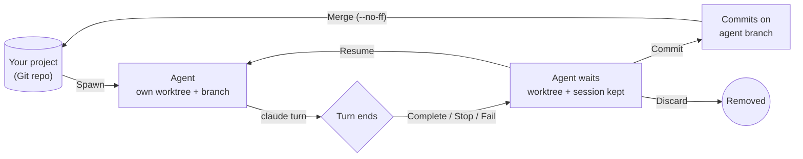

<div align="center">

<picture>
  <source media="(prefers-color-scheme: dark)" srcset="docs/assets/logo-dark.svg">
  
</picture>

# Orchestrate

**Run a fleet of Claude Code agents, each in its own Git worktree, and stay in control of all of them.**

[](#alpha)
[](LICENSE)
[](#install)
[](https://tauri.app)

[Install](#install) · [Quick start](#quick-start) · [How it works](#how-it-works) · [Multiple machines](#run-agents-on-your-other-machines) · [Build from source](#build-from-source)

</div>

---

<a name="alpha"></a>

> [!WARNING]
> **🚧 Alpha software.**
> Orchestrate is at **v0.1.0** and changing fast. Expect rough edges, breaking changes between releases, and state files that may not carry over. The macOS and Windows builds aren't code-signed yet.
>
> By default, agents run with **all permissions granted** inside their worktree. Read [Safety](#safety) before you point this at a repository you care about.

---

Orchestrate is a lightweight desktop app for running several [Claude Code](https://docs.claude.com/en/docs/claude-code/overview) agents at once. Each agent gets its own Git worktree and branch, so they can all work in parallel without stepping on each other or on your checkout. You watch their output live, send follow-ups, stop them when they go the wrong way, then review the diff and merge the work you want to keep.

Claude Code does all the coding. Orchestrate manages the agents around it: it doesn't have its own agent loop, and it runs the real `claude` CLI with your login, skills and settings.

## Features

|  |  |
| --- | --- |
| 🌳 **Isolated by default** | Every agent runs in its own Git worktree on its own branch. Your checkout is never touched until you choose to merge. |
| 📡 **Live, readable output** | Output streams as it happens and is grouped into rows. Eight reads show as `Read ×8`, not eight cards, and thinking and tool calls fold away. |
| ⏯️ **Stop, resume, queue** | Stop an agent mid-turn, resume it with a correction, or queue follow-ups while it's still working. The queue runs in order, one message per completed turn. |
| 🔀 **Review and merge** | Read everything an agent changed as one diff against where it started. Commit it and merge it into any branch with `--no-ff`. |
| 🧩 **Conflicts handled by an agent** | When a merge conflicts, a Resolver agent settles it in its own worktree, so your project is never left half-merged. |
| 🖥️ **Agents on every machine** | Run agents on your desktop, laptop or a home server, and control them all from one window over [Tailscale](https://tailscale.com). You can hand work from one machine to another. |
| 🎛️ **Per-agent model and effort** | Pick the model and effort level for each agent. Start cheap and move up when you resume. The model list comes from your own account. |
| ⌨️ **Slash commands work** | Your skills and Claude Code's built-in commands work from the `/` menu. `/commit`, `/merge`, `/rename`, `/color`, `/model` and others are handled by the app. |
| 📎 **Attachments** | Drop files anywhere on the window, pick them with the paperclip, or paste screenshots. Claude reads code, images and PDFs. |
| 📊 **Usage at a glance** | See tokens, cost per model, and how much of your rate limits is used, across every agent on every machine (`Ctrl+Shift+U`). |
| 🔔 **Notifications** | Get a notification when an agent finishes, fails or needs you. |
| 🎨 **18 themes** | Orchestrate's own light and dark themes, plus Catppuccin, Dracula, Everforest, Gruvbox, Nord, One Dark, Rosé Pine, Solarized, Tokyo Night and more. |

<!-- TODO: add a screenshot or short screen recording here, e.g.
<p align="center"></p>
-->

## Install

### Requirements

- **[Claude Code](https://docs.claude.com/en/docs/claude-code/setup)**, installed and logged in: `claude` must be on your `PATH`.
- **Git**
- **[Tailscale](https://tailscale.com)**. This is *optional* and only needed to run agents on more than one machine.

### Download

Get the installer for your platform from the [**Releases**](https://github.com/devontheriault/DevCode/releases) page:

| Platform | Formats |
| --- | --- |
| Linux | `.AppImage`, `.deb`, `.rpm` |
| macOS (Universal) | `.dmg` |
| Windows | `.msi`, `.exe` |

<details>
<summary><b>First launch on macOS or Windows</b></summary>

These builds aren't code-signed yet, so the OS warns you the first time you open them.

- **macOS:** right-click the app and choose **Open**, or run
  `xattr -dr com.apple.quarantine /Applications/Orchestrate.app`
- **Windows:** in the SmartScreen prompt, click **More info → Run anyway**.

</details>

## Quick start

1. **Add a project.** Click **+** in the sidebar and choose a Git repository.
2. **Spawn an agent.** Click **New agent**, describe the task, pick a model, and send. Orchestrate creates a worktree and a branch, then starts `claude` in it.
3. **Watch it work.** Output streams into the transcript. Type a follow-up at any time. If the agent is busy, it's added to the queue.
4. **Stop or resume.** Stop an agent that's going the wrong way, then resume it with a correction. Its conversation and files are kept.
5. **Review and merge.** Open the **Diff** tab, **Commit**, then **Merge** into the branch you choose. Or type `/commit` and `/merge`.
6. **Clean up.** **Discard** an agent when you're done with it. That removes its worktree and branch.

Spawn as many agents as you like. They each work on their own copy of the repository.

## How it works



- An **Agent** is one `claude` process at a time, tied to one worktree and one task. Each prompt-and-answer exchange is a **Turn**. Resuming starts a new `claude --resume` in the same worktree, so the conversation continues where it left off.
- Worktrees are kept outside your project, in Orchestrate's state directory (`~/.local/state/orchestrate` on Linux, the local app-data folder on macOS and Windows). Agent logs are kept even after an agent is discarded.
- Nothing is ever written to your project except by a **Merge**, and only you start one. **Discard** is the only action that deletes anything.
- Agents belong to a **Host**, a background process that owns them. If you close the window, your agents keep working. If the machine restarts mid-turn, those agents show up as **Orphaned** so you can resume or discard them.

The vocabulary is defined precisely in [`CONTEXT.md`](CONTEXT.md), and the reasons behind the design are recorded as [architecture decision records](docs/adr/).

## Run agents on your other machines

Every machine running Orchestrate is a Host. To see and control a second machine's agents from this window:

1. Install Orchestrate and Tailscale on both machines, logged in as the **same Tailscale user**.
2. Open **Settings → Hosts…** and add the other machine by its Tailscale name.

That machine's projects are merged with yours by Git remote, so one project's agents appear together whichever machine they run on. You choose the machine when you spawn an agent. If a project isn't checked out on a machine, that machine clones it itself. To continue an agent's work somewhere else, pick another Host for its next prompt: its commits are **handed off** to a new agent on that machine.

To keep a machine's agents running after you log out, and start its Host at boot, turn on **Settings → Keep agents running when logged out**.

## Safety

Please read this before running agents on anything important.

- **Agents run in YOLO mode by default** (`--permission-mode bypassPermissions`). They can run any command as your user without asking. The worktree keeps their *edits* away from your checkout, but it is **not a sandbox**: a command can still reach anything your account can reach. Switch an agent to **plan** mode when you only want it to read and propose.
- **Remote Hosts only listen on Tailscale.** The listener binds to the machine's tailnet address on port `47300`, never to every interface. Each connection is checked with Tailscale and accepted only from your own Tailscale identity, so devices shared into your tailnet are refused. Without Tailscale there's no network listener at all. See [ADR 0012](docs/adr/0012-tailscale-identity-is-the-trust.md).
- Agents use your own Claude Code login, settings and skills, and their usage counts against your account.

## Build from source

You'll need [Node.js](https://nodejs.org) (LTS), a stable [Rust](https://rustup.rs) toolchain, and the [Tauri prerequisites](https://tauri.app/start/prerequisites/) for your OS. On Debian or Ubuntu, that's:

```sh
sudo apt install libwebkit2gtk-4.1-dev libappindicator3-dev librsvg2-dev patchelf
```

Then:

```sh
git clone https://github.com/devontheriault/DevCode.git orchestrate
cd orchestrate
npm install
npm run tauri dev      # run the app with hot reload
```

| Command | What it does |
| --- | --- |
| `npm run tauri dev` | Run the desktop app in development mode |
| `npm run check` | Type-check the Svelte and TypeScript frontend |
| `cargo test --manifest-path src-tauri/Cargo.toml` | Run the Rust test suite |
| `npm run build:linux` | Build Linux bundles for local testing |

Release builds come from CI, not from a dev machine. See [`docs/releasing.md`](docs/releasing.md) for how releases work and why.

### Project layout

```
src/            SvelteKit frontend (Svelte 5, TypeScript)
  lib/          UI grouped by feature: agent, transcript, sidebar, usage, theme…
src-tauri/      Rust backend (Tauri 2)
  src/runtime/  live agents: one `claude` process per turn
  src/git/      worktrees, diffs, commits and merges
  src/host/     the Host process and its Tailscale listener
docs/adr/       architecture decision records
CONTEXT.md      the project's vocabulary
```

## Contributing

Orchestrate is in alpha and its design is still settling, so **open an issue before starting on anything large**. Bug reports are very welcome, especially from macOS and Windows. Before you dive into the code, [`CONTEXT.md`](CONTEXT.md) and the [ADRs](docs/adr/) are the best place to learn how the project thinks.

## License

[MIT](LICENSE) © 2026 Devon Theriault. Anyone can use, copy, modify and distribute it, including commercially.

<sub>Orchestrate is an independent project and is not affiliated with or endorsed by Anthropic. Claude and Claude Code are trademarks of Anthropic, PBC.</sub>
