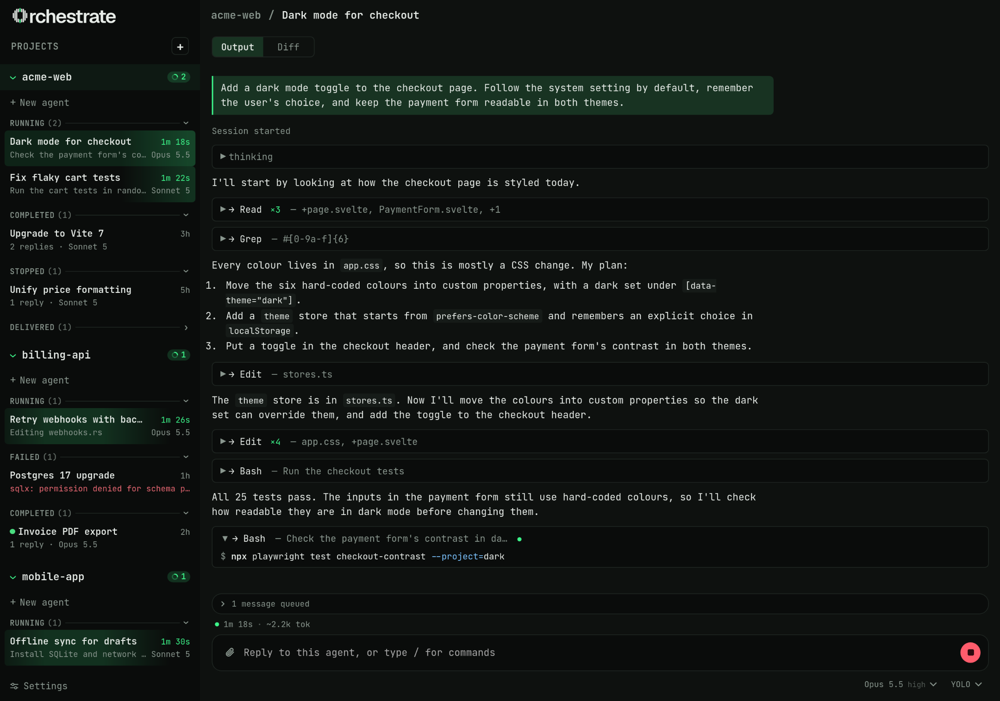

<div align="center">

<picture>
  <source media="(prefers-color-scheme: dark)" srcset="docs/assets/logo-dark.svg">
  
</picture>

# Orchestrate

Orchestrate is a lightweight desktop app for running several Claude Code agents in parallel, each in its own Git worktree so they never step on each other. You watch their output live, send follow-ups, stop them when they go the wrong way, then review the changes and merge the work you want to keep.

[](#alpha)
[](LICENSE)
[](#install)
[](https://tauri.app)

[Install](#install) · [Quick start](#quick-start) · [Multiple machines](#run-agents-on-your-other-machines) · [Build from source](#build-from-source)

</div>

---

<a name="alpha"></a>

> [!WARNING]
> This is alpha software (v0.1.0). Things will break, releases may not be compatible with each other, and your saved state might not survive an update. The macOS and Windows builds aren't code-signed yet either.
>
> Agents also run with every permission turned on by default. Have a look at [Safety](#safety) before using it on a repo you care about.

---

I built Orchestrate because I kept wanting to run several [Claude Code](https://docs.claude.com/en/docs/claude-code/overview) sessions in parallel without them tripping over each other. Every agent gets its own worktree and branch, so you can have a few of them going on the same repo while your own checkout stays untouched. You can watch them work, nudge them when they drift, and merge whatever turns out well.

It doesn't replace Claude Code. It runs the actual `claude` CLI under your own login, with your skills and settings, and just handles the bookkeeping around it.

## Features

- Every agent works in its own Git worktree and branch. Nothing lands in your checkout until you merge it.
- Stop an agent mid-turn, resume it with a correction, or queue up follow-ups while it's still busy.
- See everything an agent changed as a single diff, then commit and merge it into whichever branch you want.
- If a merge conflicts, a separate agent resolves it in its own worktree so your project isn't left half-merged.
- Control agents on your other machines (a laptop, a home server) from the same window over [Tailscale](https://tailscale.com), and move work between them.
- Choose the model and effort level per agent. The model list comes from your account.
- Your skills and Claude Code's slash commands work from the `/` menu, along with a few of the app's own like `/commit` and `/merge`.
- Drop in files, images, PDFs or pasted screenshots.
- Keep an eye on token usage, cost and rate limits across all your agents (`Ctrl+Shift+U`).
- Get notified when an agent finishes, fails or needs you.
- 18 themes, including Catppuccin, Dracula, Gruvbox, Nord, Rosé Pine and Tokyo Night.

<p align="center"></p>

## Install

You'll need:

- [Claude Code](https://docs.claude.com/en/docs/claude-code/setup), installed and logged in, with `claude` on your `PATH`
- Git
- [Tailscale](https://tailscale.com), but only if you want to run agents on more than one machine

Then grab an installer from the [Releases](https://github.com/devontheriault/Orchestrate/releases) page:

| Platform | Formats |
| --- | --- |
| Linux | `.AppImage`, `.deb`, `.rpm` |
| macOS (Universal) | `.dmg` |
| Windows | `.msi`, `.exe` |

<details>
<summary><b>First launch on macOS or Windows</b></summary>

The builds aren't signed yet, so your OS will complain the first time you open them.

- **macOS:** right-click the app and choose **Open**, or run
  `xattr -dr com.apple.quarantine /Applications/Orchestrate.app`
- **Windows:** in the SmartScreen prompt, click **More info → Run anyway**.

</details>

## Quick start

1. Click **+** in the sidebar and pick a Git repo to add it as a project.
2. Click **New agent**, describe what you want done, pick a model and send it. Orchestrate makes a worktree and branch and starts `claude` there.
3. Watch the output come in. You can type a follow-up whenever you like; if the agent's busy it gets queued.
4. If it's heading the wrong way, stop it and resume with a correction. It keeps its conversation and files.
5. When you're happy, open the **Diff** tab, hit **Commit**, then **Merge** into a branch. `/commit` and `/merge` do the same thing.
6. **Discard** the agent once you're done to remove its worktree and branch.

Start as many agents as you like. Each one has its own copy of the repo.

## Run agents on your other machines

Each machine running Orchestrate can host its own agents, and you can connect to them from one window:

1. Install Orchestrate and Tailscale on both machines, signed in as the same Tailscale user.
2. Go to **Settings → Hosts…** and add the other machine by its Tailscale name.

Projects are matched up by their Git remote, so agents for the same repo show up together no matter which machine they're on. When you spawn an agent you pick where it runs, and if the repo isn't on that machine yet it gets cloned. To move an agent's work to another machine, pick a different Host for its next prompt and its commits get handed over to a new agent there.

If you want a machine's agents to keep running after you log out (and start back up on boot), turn on **Settings → Keep agents running when logged out**.

## Give Claude access to the app

Orchestrate has its own MCP server, `orchestrate --mcp`. Every agent it starts is already connected to it, so agents can find, read and write your notes, read your calendar, list your other agents, check how one is doing and read its last answer, all without any setup. Agents can create, edit and rename notes, since they're files on your machine that you can see and undo, but they can't delete one. They can also draft a calendar event, but nothing the server does leaves your machine: a draft waits for you to send it.

To give the same tools to a plain `claude` in a terminal:

```sh
claude mcp add orchestrate -- orchestrate --mcp
```

For Claude Desktop, add it to `claude_desktop_config.json` (**Settings → Developer → Edit Config**):

```json
{
  "mcpServers": {
    "orchestrate": { "command": "orchestrate", "args": ["--mcp"] }
  }
}
```

`orchestrate` is the app's own binary. If it isn't on your `PATH`, use its full path instead. For the AppImage, that's the path to the AppImage file. The server talks to the app's background process, which the app starts when it opens, so open Orchestrate once after logging in.

## Safety

Agents run in YOLO mode by default (`--permission-mode bypassPermissions`), which means they can run any command as your user without asking first. The worktree keeps their edits away from your checkout, but it isn't a sandbox. If you just want an agent to look around and suggest changes, switch it to **plan** mode.

Agents also run under your own Claude Code login, so everything they do counts against your usage and rate limits.

## Build from source

You'll need [Node.js](https://nodejs.org) (LTS), a stable [Rust](https://rustup.rs) toolchain, and the [Tauri prerequisites](https://tauri.app/start/prerequisites/) for your OS. On Debian or Ubuntu that's:

```sh
sudo apt install libwebkit2gtk-4.1-dev libappindicator3-dev librsvg2-dev patchelf
```

Then:

```sh
git clone https://github.com/devontheriault/Orchestrate.git orchestrate
cd orchestrate
npm install
npm run tauri dev      # run the app with hot reload
```

| Command | What it does |
| --- | --- |
| `npm run tauri dev` | Run the app in development mode |
| `npm run check` | Type-check the frontend |
| `cargo test --manifest-path src-tauri/Cargo.toml` | Run the Rust tests |
| `npm run build:linux` | Build Linux bundles for local testing |

Release builds are made in CI rather than locally. [`docs/releasing.md`](docs/releasing.md) explains how that works.

### Project layout

```
src/            SvelteKit frontend (Svelte 5, TypeScript)
  lib/          UI grouped by feature: agent, transcript, sidebar, usage, theme…
src-tauri/      Rust backend (Tauri 2)
  src/runtime/  live agents: one `claude` process per turn
  src/git/      worktrees, diffs, commits and merges
  src/host/     the Host process and its Tailscale listener
  src/mcp/      `orchestrate --mcp`, the MCP server agents reach the app through
docs/adr/       architecture decision records
CONTEXT.md      the project's vocabulary
```

## Contributing

Things are still moving around a lot, so if you're planning something big, open an issue first so we can talk it through. Bug reports are always welcome, especially from macOS and Windows since I don't test there much. If you want to dig into the code, [`CONTEXT.md`](CONTEXT.md) and the [ADRs](docs/adr/) are good places to start.

## License

[MIT](LICENSE) © 2026 Devon Theriault.

<sub>Orchestrate is an independent project and is not affiliated with or endorsed by Anthropic. Claude and Claude Code are trademarks of Anthropic, PBC.</sub>
